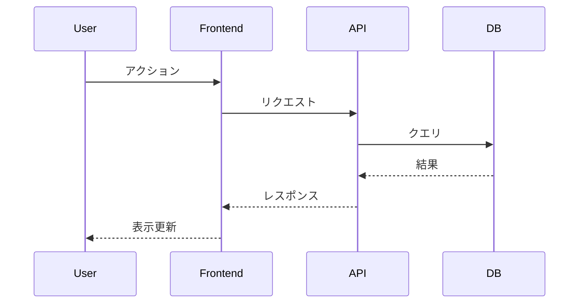

# システムアーキテクト設計 (System Architecture)

## Overview

要件定義書をもとに、API通信・シーケンス図・コンポーネント間依存関係を設計する。
特に**デプロイ粒度の特定**が重要 — これが後のPR分割の基準になる。

**Announce at start:** 「システム設計フェーズを開始します。要件定義書をもとにAPI設計とコンポーネント構成を整理します。」

## The Process

### Step 1: 既存アーキテクチャの把握

1. 既存のコードベース構造を確認
2. デプロイ単位 (サーバー/フロントエンド/バッチ等) を特定
3. 既存のAPI設計パターンを確認
4. 技術スタックの確認

### Step 2: コンポーネント分析

デプロイ粒度の観点で関連コンポーネントを整理する:

```
例:
├── サーバー (API) — 独立デプロイ
├── フロントエンド (Web) — 独立デプロイ
├── バッチ処理 — 独立デプロイ
└── 共通ライブラリ — 各コンポーネントに含まれる
```

**重要:** 各コンポーネントは非同期でデプロイされるため、依存関係がある修正を1つのPRに入れない。

### Step 3: API設計

影響するAPIを設計する:

```markdown
### API: [エンドポイント名]

- Method: POST/GET/PUT/DELETE
- Path: /api/v1/...
- Request:
  ```json
  { ... }
  ```
- Response:
  ```json
  { ... }
  ```
- 備考: ...
```

### Step 4: シーケンス図

主要なユースケースについてMermaid形式でシーケンス図を作成:



### Step 5: デプロイ依存関係マップ

修正がどのコンポーネントに影響するかをマッピングし、PR分割の基準を定義:

```markdown
## デプロイ依存関係

### 変更グループA: サーバー API追加
- 影響コンポーネント: API サーバー
- デプロイ単位: サーバー
- 先行リリース可能: はい

### 変更グループB: フロント API利用
- 影響コンポーネント: フロントエンド
- デプロイ単位: フロントエンド
- 依存: 変更グループA がデプロイ済みであること
```

### Step 6: 設計書の作成

以下のテンプレートで作成する:

```markdown
# [機能名] システム設計書

## 1. 概要
- アーキテクチャ方針 (2-3文)

## 2. コンポーネント構成
- 影響範囲と各コンポーネントの役割

## 3. API設計
### 3.1 新規API
### 3.2 既存API変更

## 4. データモデル変更
- テーブル追加・変更

## 5. シーケンス図
- 主要ユースケース

## 6. デプロイ依存関係マップ
- コンポーネント別の変更グループ
- リリース順序制約

## 7. 技術的考慮事項
- パフォーマンス
- セキュリティ
- 後方互換性
```

### Step 7: 保存とコミット

1. `aidlc-docs/designs/YYYY-MM-DD-<feature>.md` に保存
2. gitにコミット

### Step 8: Human Review Gate への遷移

> **設計レビュー待ち**
>
> 要件定義書: `aidlc-docs/requirements/<file>`
> 設計書: `aidlc-docs/designs/<file>`
>
> 上記ドキュメントを確認して、フィードバックまたは承認をお願いします。

<HARD-GATE>
人による承認を得るまで Construction Phase に進んではならない。
</HARD-GATE>
