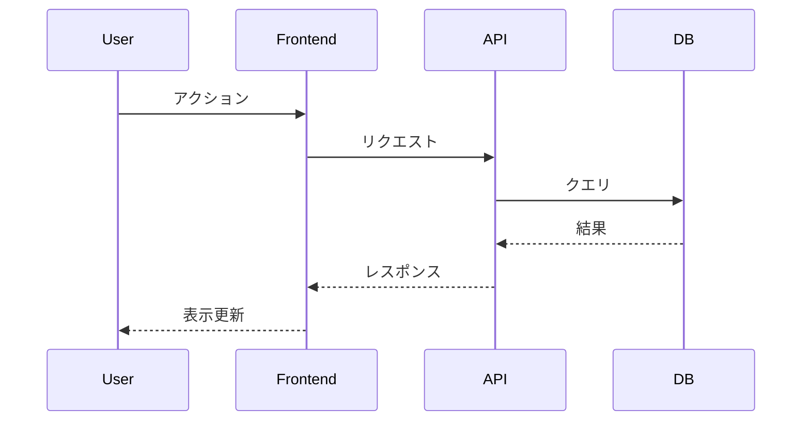

# システムアーキテクト設計 (System Architecture)

## Overview

要件定義書をもとに、API通信・シーケンス図・コンポーネント間依存関係を設計する。
特に**デプロイ粒度の特定**が重要 — これが後のPR分割の基準になる。

**Announce at start:** 「システム設計フェーズを開始します。要件定義書をもとにAPI設計とコンポーネント構成を整理します。」

## The Process

### Step 1: 既存アーキテクチャの把握

1. 既存のコードベース構造を確認
2. デプロイ単位 (サーバー/フロントエンド/バッチ等) を特定
3. 既存のAPI設計パターンを確認
4. 技術スタックの確認

### Step 2: コンポーネント分析

デプロイ粒度の観点で関連コンポーネントを整理する:

```
例:
├── サーバー (API) — 独立デプロイ
├── フロントエンド (Web) — 独立デプロイ
├── バッチ処理 — 独立デプロイ
└── 共通ライブラリ — 各コンポーネントに含まれる
```

**重要:** 各コンポーネントは非同期でデプロイされるため、依存関係がある修正を1つのPRに入れない。

### Step 3: API設計

影響するAPIを設計する:

```markdown
### API: [エンドポイント名]

- Method: POST/GET/PUT/DELETE
- Path: /api/v1/...
- Request:
  ```json
  { ... }
  ```
- Response:
  ```json
  { ... }
  ```
- 備考: ...
```

### Step 4: シーケンス図

主要なユースケースについてMermaid形式でシーケンス図を作成:



### Step 5: デプロイ依存関係マップ

修正がどのコンポーネントに影響するかをマッピングし、PR分割の基準を定義:

```markdown
## デプロイ依存関係

### 変更グループA: サーバー API追加
- 影響コンポーネント: API サーバー
- デプロイ単位: サーバー
- 先行リリース可能: はい

### 変更グループB: フロント API利用
- 影響コンポーネント: フロントエンド
- デプロイ単位: フロントエンド
- 依存: 変更グループA がデプロイ済みであること
```

### Step 6: 設計書の作成

以下のテンプレートで作成する:

```markdown
# [機能名] システム設計書

## 1. 概要
- アーキテクチャ方針 (2-3文)

## 2. コンポーネント構成
- 影響範囲と各コンポーネントの役割

## 3. API設計
### 3.1 新規API
### 3.2 既存API変更

## 4. データモデル変更
- テーブル追加・変更

## 5. シーケンス図
- 主要ユースケース

## 6. デプロイ依存関係マップ
- コンポーネント別の変更グループ
- リリース順序制約

## 7. 技術的考慮事項
- パフォーマンス
- セキュリティ
- 後方互換性
```

### Step 7: 設計書の検証ループ (Evaluator-Driven)

作成した設計書の複雑性を判定し、必要に応じてエージェントによるレビューを実施する。
**最大2周**でループを終了する。

```
┌─────────────────────────────────────────────────┐
│          設計書 検証ループ                        │
│                                                  │
│  複雑性判定 → エージェント選定 → Check → Act     │
│       ▲                                  │      │
│       └──────────────────────────────────┘      │
│                                                  │
│  終了条件: 全Evaluator PASS or 2周到達           │
│  ※ 軽微な設計はセルフチェックのみで通過          │
└─────────────────────────────────────────────────┘
```

#### Phase 1: Plan — 複雑性判定とエージェント選定

設計の複雑性を以下の基準で判定し、**必要なエージェントだけ**を立ち上げる。

**複雑性の判定基準:**

| レベル | 条件例 | 対応 |
|--------|-------|------|
| **S (軽微)** | 既存コンポーネント内の小変更、設計判断が不要な修正 | エージェント不要。セルフチェックのみで Step 8 へ |
| **M (中規模)** | 1-2コンポーネントの変更、API追加/変更、既存パターンの踏襲 | コアエージェントのみ |
| **L (大規模)** | 複数デプロイ単位にまたがる変更、新規アーキテクチャパターン導入、DB設計変更、外部連携追加 | フルレビュー |

**レベル別エージェント選定:**

| エージェント | S | M | L | 検証観点 |
|------------|---|---|---|---------|
| セルフチェック (エージェントなし) | ✅ | ✅ | ✅ | テンプレート準拠・図とテキストの一致 |
| `ecc:doc-architect` (sonnet) | - | ✅ | ✅ | Mermaid図の正確性・テンプレート充足度 |
| `ecc:architect` (opus) | - | ✅ | ✅ | コンポーネント分割・API一貫性・スケーラビリティ |
| `ecc:security-reviewer` (sonnet) | - | ※ | ✅ | API認証/認可・データフローのセキュリティ境界 |
| `ecc:database-reviewer` (sonnet) | - | ※ | ※ | スキーマ設計・インデックス・RLS |
| `aidlc:domain-expert` (opus) | - | - | ✅ | ドメインモデル→設計の整合性・業務フロー |
| `aidlc:holistic-reviewer` (opus) | - | - | ✅ | 要件→設計の整合性マトリクス・全体バランス |
| `ecc:planner` (opus) | - | - | ✅ | 実装計画の具体性・フェーズ分割・テスト戦略 |

※ 該当する変更がある場合のみ (セキュリティ: 認証/API / DB: データモデル変更)

> 「設計の複雑性: [S/M/L] と判定しました。
> [S の場合] セルフチェックのみで進めます。
> [M/L の場合] 検証ループを開始します (ラウンド 1/2)。有効なEvaluator: [一覧]」

**S の場合はセルフチェック (テンプレート準拠・図の整合性) のみ行い、Step 8 に進む。**

#### Phase 2: Do — 設計書の整備

Step 6 で作成した設計書を確定する。
初回はそのまま Check フェーズへ、2周目以降は Act の修正を反映済みの状態で進む。

#### Phase 3: Check — レビュー実行

Phase 1 で選定したエージェントを**並列**で実行する。

各エージェントの検証観点:

**`ecc:doc-architect`** (sonnet)
- テンプレート準拠・Mermaid図の構文と論理整合性・図とテキストの一致

**`ecc:architect`** (opus)
- コンポーネント分割・API一貫性・シーケンス図との整合・スケーラビリティ

**`ecc:security-reviewer`** (sonnet)
- API認証/認可設計・データフローのセキュリティ境界・入力バリデーション

**`ecc:database-reviewer`** (sonnet)
- テーブル設計・インデックス戦略・マイグレーション安全性・外部キー制約

**`aidlc:domain-expert`** (opus)
- ドメインモデルの反映・API設計と業務フローの整合・状態遷移の妥当性

**`aidlc:holistic-reviewer`** (opus)
- 要件→設計の整合性マトリクス・過剰/過小設計・リスクマップ

**`ecc:planner`** (opus)
- 実装ステップの導出可能性・フェーズ独立性・テスト戦略カバレッジ

```
ARCHITECTURE REVIEW REPORT (Round N/2)
=======================================
[選定されたエージェントのみ表示]
architect:          [PASS/WARN] (設計妥当性: OK, 懸念: N件)
doc-architect:      [PASS/WARN] (構造: OK, 図の整合性: OK)
...

Verdict: [ALL PASS → Step 8 へ / IMPROVEMENTS FOUND → Act フェーズへ]
```

#### Phase 4: Act — 設計書の改善

evaluatorの指摘に基づき設計書を修正する:

| 指摘の種類 | 対応 |
|-----------|------|
| Mermaid図の構文エラー・不整合 | 自動修正 |
| テンプレート未充足セクション | 自動補完 |
| セキュリティ設計の欠落 | 技術的考慮事項セクションに追記 |
| DB設計の問題 (インデックス不足等) | データモデルセクションを修正 |
| API設計の不整合 | 自動修正 (命名・レスポンス形式の統一) |
| ドメインモデルの表現不足 (domain-expert指摘) | コンポーネント構成・データモデルを修正 |
| 要件との不整合 (holistic-reviewer指摘) | 該当セクションを要件に合わせて修正 |
| 実装フェーズの具体性不足 (planner指摘) | 技術的考慮事項に実装ガイダンスを追記 |
| アーキテクチャ上の重大な懸念 | ⚠️ ユーザーに確認してから修正 |
| デプロイ依存関係の変更 | ⚠️ ユーザーに確認してから修正 |
| ドメインモデルの根本的な見直し | ⚠️ ユーザーに確認してから修正 |

**アーキテクチャ判断やデプロイ戦略に関わる変更は自動修正せず、必ずユーザーに確認する。**

修正後、Plan フェーズに戻り再検証 (ラウンド +1)。

> 「設計書の検証ループ完了 (ラウンド N/2)
> - 自動改善: X件 適用済み
> - ユーザー確認待ち: Y件 (ある場合)」

### Step 8: 保存とコミット

1. `aidlc-docs/designs/YYYY-MM-DD-<feature>.md` に保存
2. gitにコミット

### Step 9: Human Review Gate への遷移

> **設計レビュー待ち**
>
> 要件定義書: `aidlc-docs/requirements/<file>`
> 設計書: `aidlc-docs/designs/<file>`
>
> 上記ドキュメントを確認して、フィードバックまたは承認をお願いします。

<HARD-GATE>
人による承認を得るまで Construction Phase に進んではならない。
</HARD-GATE>
